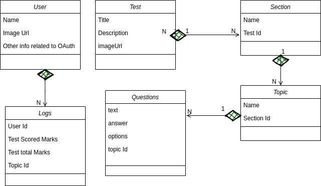
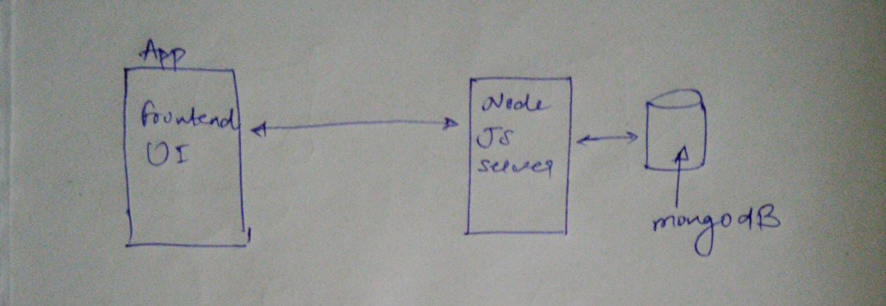

# ourTest (A Test System)

It is an end to end real-time, responsive test website for 
hard-working aspiring candidates where they can practice for
exams of their choice.

#### This project consists of 2 parts:
- Frontend: build in reactJs and bootstrap using javascript, HTML
 and CSS
- Backend: build in nodeJs, mongoDB.

## Requirements of Test System
- User can select the Test category like JEE Advance, CAT, GATE, etc.
- User can further select the subsections inside of test category.
- Every sub-area's can have multiple topic.
- You can perform quiz on a particular chapter.
- Every chapter can have multiple questions.
- User can signup, login and logout.
- User can even view his dashboard.

<table style="width: 100%">
    <tr>
        <th>Actor</th>
        <th>Use Case</th>
    </tr>
    <tr>
        <td>User</td>
        <td>
            Can select test category, subsection category and topic,
            can do quiz, can login, can see to dashboard.
        </td>
    </tr>
</table>

## Class Diagram

## Configure to run app
As I have earlier there are 2 parts in this project. For frontend
part it is very simple. For the backend part, it is also very 
simple just you have to run mongo server in local and import 
few collections and then run the nodeJs server.

- Clone the repository.
- In the frontend folder run command <b>npm install</b> and 
<b>npm start</b>. 
Now, your frontend app server will be running on port 3000.
- Run mongoDB server on local and import certain necessary 
collection to dB ourTest as is given in the folder 
<a href="/backend/database">/backend/database</a>.
- Then in the backend folder also, run command <b>npm install</b> and <b>npm start </b> 
to run the nodeJs server.

Our basic structure will look like this:

Go head and have a code look!

