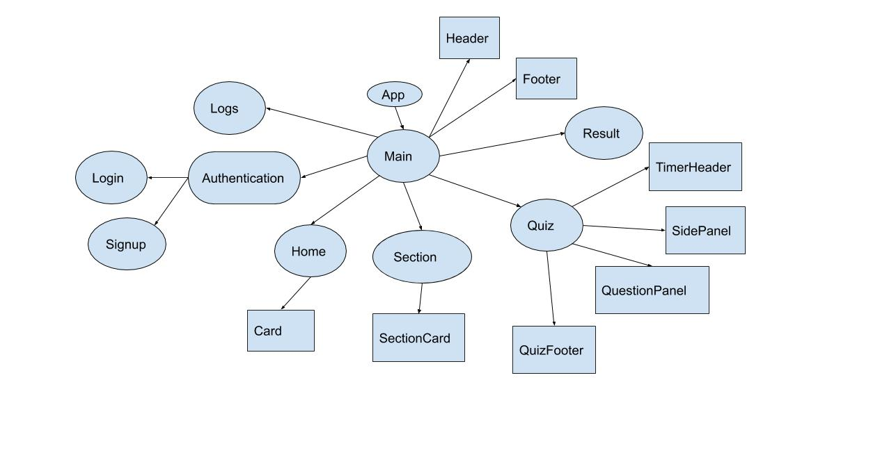

This is the frontend part of the project completely written in 
reactJs.

Directory structures of this section are as follows:
- json-server
- public
- src

<strong>json-server</strong> directory is for
the local server creation for the frontend.

<strong>public</strong> directory consists
of icons and certain basic files for this 
app.

<strong>src</strong> directory consists of
the main code files and folders so
let's dive straight away to it.

Let's break our app into certain modules
on the basis of the requirements:

- <b>home module</b>( consists of the home page display)
- <b>section module</b>( consists of the section
page display)
- <b>quiz module</b>( consists of the quiz page
display and which further consists of timerHeader,
questionPanel, sidePanel and quizFooter in itself)
- <b>Result module</b>( consists of displaying of the result)
- <b>Authentication module</b> (consists of login,
logout and signup )
- <b>Logs module</b> (consists of tests logs related 
to the particular user.)

Below given is the component structure of the
app.

Here, every box represents the component. Oval box represents
the page component in page directory. Rectangle component represents
the helper component in components folder.

In the redux directory, we have four types of files:
- ActonCreators file
- ActionTypes file
- configureStore file( creates the stores, combine the
different reducers, applying middleware, subscriber action
to store)
- reducers file(this files includes forms.js, login.js,
 logs.js, tests.js, sections.js, quiz.js, etc)

    

